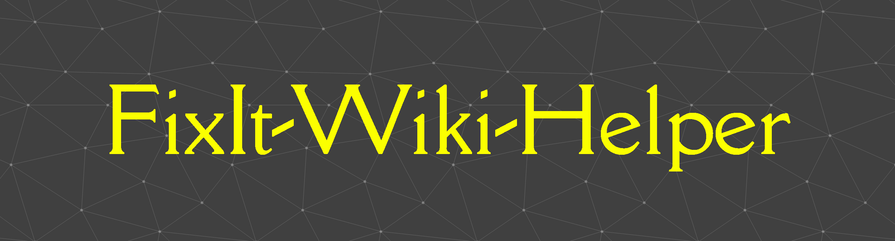

## Project Description

`FixIt-Wiki-Helper` is a modular technical documentation center (knowledge base & runbook repository). This repository is dedicated to recording troubleshooting solutions, system configurations, and operational development guides in a structured, concise, and easily accessible manner.
Each document follows the standard format **Problem /Context → Root Cause → Resolution /Steps**to ensure consistency and efficiency during the debugging and onboarding process.

## Navigation Structure

Documentation is grouped by technical domain. Each category has its own modular folder.

### 💻 Terminal Commands
Quick-reference command cheat sheets for daily terminal work, organized by shell type (not OS, since a shell can run across multiple operating systems).\
-[Bash Cheat Sheet](./Terminal-Commands/bash-cheatsheet.md)\
-[CMD (Command Prompt) Cheat Sheet](./Terminal-Commands/cmd-cheatsheet.md)\
-[PowerShell Cheat Sheet](./Terminal-Commands/powershell-cheatsheet.md)\
-[Bourne Shell (sh) Cheat Sheet](./Terminal-Commands/sh-cheatsheet.md)\
-[Zsh (Z Shell) Cheat Sheet](./Terminal-Commands/zsh-cheatsheet.md)\
-[C Shell (csh/tcsh) Cheat Sheet](./Terminal-Commands/csh-cheatsheet.md)\
-[Korn Shell (ksh) Cheat Sheet](./Terminal-Commands/ksh-cheatsheet.md)\
-[Fish Cheat Sheet](./Terminal-Commands/fish-cheatsheet.md)\
-[Dash Cheat Sheet](./Terminal-Commands/dash-cheatsheet.md)\
-[BusyBox ash Cheat Sheet](./Terminal-Commands/busybox-ash-cheatsheet.md)\
-[mksh (Android Default Shell) Cheat Sheet](./Terminal-Commands/mksh-cheatsheet.md)\
-[Nushell Cheat Sheet](./Terminal-Commands/nushell-cheatsheet.md)\
-[Git Bash/MSYS2/Cygwin Cheat Sheet](./Terminal-Commands/git-bash-msys2-cygwin-cheatsheet.md)\
-[Historical Shells (Reference)](./Terminal-Commands/historical-shells.md)\
-[Restricted Shells & Login-Denial Mechanisms](./Terminal-Commands/restricted-shells.md)\
-[WSL Cheat Sheet](./Terminal-Commands/wsl-cheatsheet.md)\
-[Niche & Modern Experimental Shells](./Terminal-Commands/niche-modern-shells.md)\

### 🖥️ Virtualization
Configuration and troubleshooting guide for virtualization platforms (VirtualBox, VMware, etc.).\
-[VirtualBox /Ubuntu Desktop](./VirtualBox/ubuntu-desktop/)
\
-[Shared Clipboard Not Working](./VirtualBox/ubuntu-desktop/shared-clipboard.md)\

### 🐧 Linux Systems & Tools
System configuration, package management, permissions, and command-line utilities in a Linux environment.\
-[File & Folder Permission Errors](./Linux-Systems/file-permission-errors.md)

### 🔀 Git & Version Control
Guide to conflict resolution, repository configuration, and workflow branching.\
-[Git General Cheat Sheet](./git/git-general.md)\
-[Resolving Merge Conflicts](./git/resolving-merge-conflicts.md)\
### 🐳 Containerization & Orchestration
Troubleshooting Docker, Docker Compose, and other container orchestrators.\
-[Common Containerization & Orchestration Issues](./Containerization/common-issues.md)\
-[Enabling HTTPS for n8n via Cloudflare Tunnel](./Containerization/n8n-https-cloudflare-tunnel.md)

### 🌐 Networking & Connectivity
Diagnose network problems, DNS, proxy and firewall configuration.\
-[DNS Resolution Issues](./Networking/common-issues.md)
-[Network Device CLI Cheat Sheet (Cisco/Junos/MikroTik/Arista)](./Networking/network-device-cli-cheatsheet.md)

### ⚙️ Dev Environment & Tooling
IDE configuration, shell, environment variables, and dependency management.\
-[Environment Variables & .env Not Loading](./Dev-Environment/env-variables-not-loading.md)
## Status
The repository is in the initialization stage. Other category folder structures will be added gradually as new documentation requires.
## 💡 Suggestions & Discussions
Have an idea for a new troubleshooting topic, found an issue not yet documented, or want to share a problem you're facing? Open a new [Issue](https://github.com/Rinwikun/FixIt-Wiki-Helper/issues/1) — tag it with `idea` or `discussion` so it's easy to find.
## 👤 Author & Credits
Created with ❤️ by Rinwikun
Distributed under the [MIT License](https://github.com/Rinwikun/FixIt-Wiki-Helper/blob/main/LICENSE).

## ☕ Support the Project

